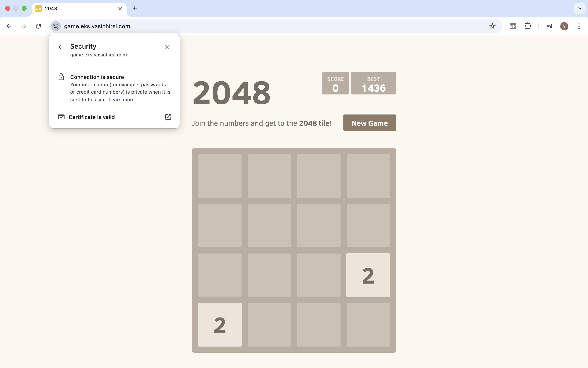
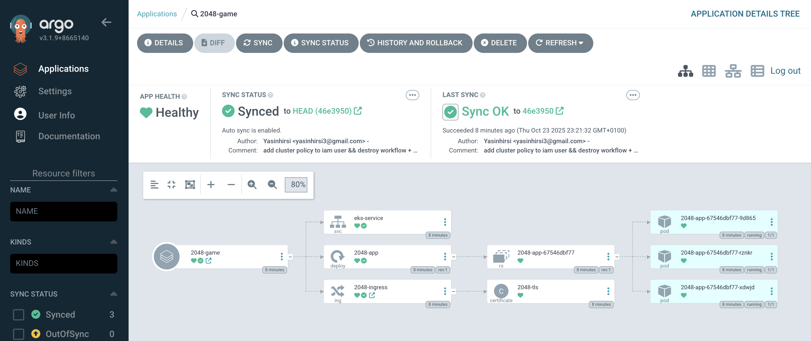
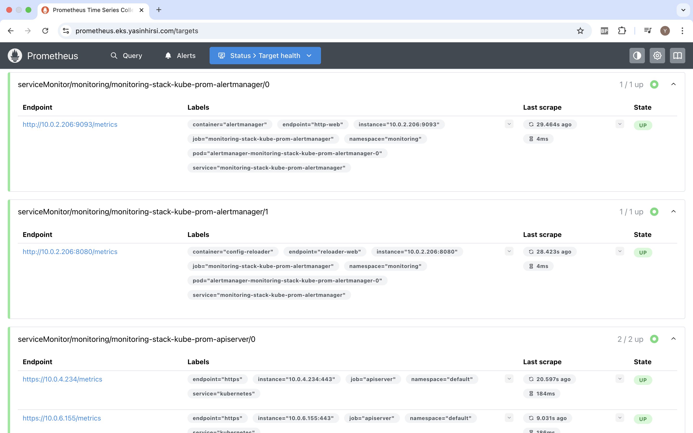
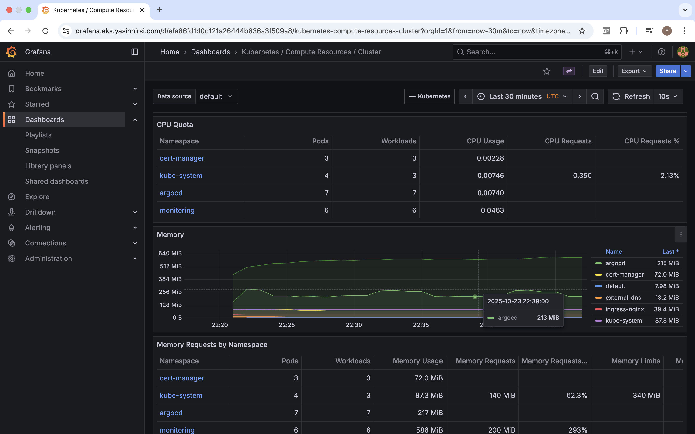

# EKS OIDC Helm Prometheus Grafana

AWS EKS infrastructure with GitHub Actions OIDC, ArgoCD GitOps, and Prometheus/Grafana monitoring.

## Architecture


## Features

### Secure Application Deployment with HTTPS



### GitOps with ArgoCD



### Prometheus Metrics Collection



### Grafana Observability Dashboards



### Key Capabilities

- Infrastructure as Code with Terraform
- GitHub Actions CI/CD using OIDC (no long-lived credentials)
- GitOps deployment with ArgoCD
- Monitoring with Prometheus & Grafana
- Automatic SSL certificates via cert-manager
- DNS management with external-dns

## Setup

### Bootstrap OIDC

```bash
./scripts/bootstrap-oidc.sh
```

### Deploy Infrastructure

```bash
cd terraform
terraform init
terraform apply
```

### Configure kubectl

```bash
aws eks update-kubeconfig --name <cluster-name> --region <region>
```

## Cleanup

### Option 1: Local Cleanup (Recommended)

```bash
cd terraform
terraform destroy
```

### Option 2: GitHub Actions

The destroy workflow excludes OIDC resources to prevent authentication failures. After running the workflow, manually clean up OIDC resources:

```bash
terraform destroy -target=aws_iam_openid_connect_provider.github_actions
terraform destroy -target=aws_iam_role.github_actions_role
```

## Stack

- **Infrastructure**: AWS EKS (1.31), VPC, IAM
- **Kubernetes Add-ons**: NGINX Ingress, cert-manager, external-dns, ArgoCD
- **Monitoring**: Prometheus, Grafana
- **CI/CD**: GitHub Actions with OIDC
- **Application**: 2048 game 

